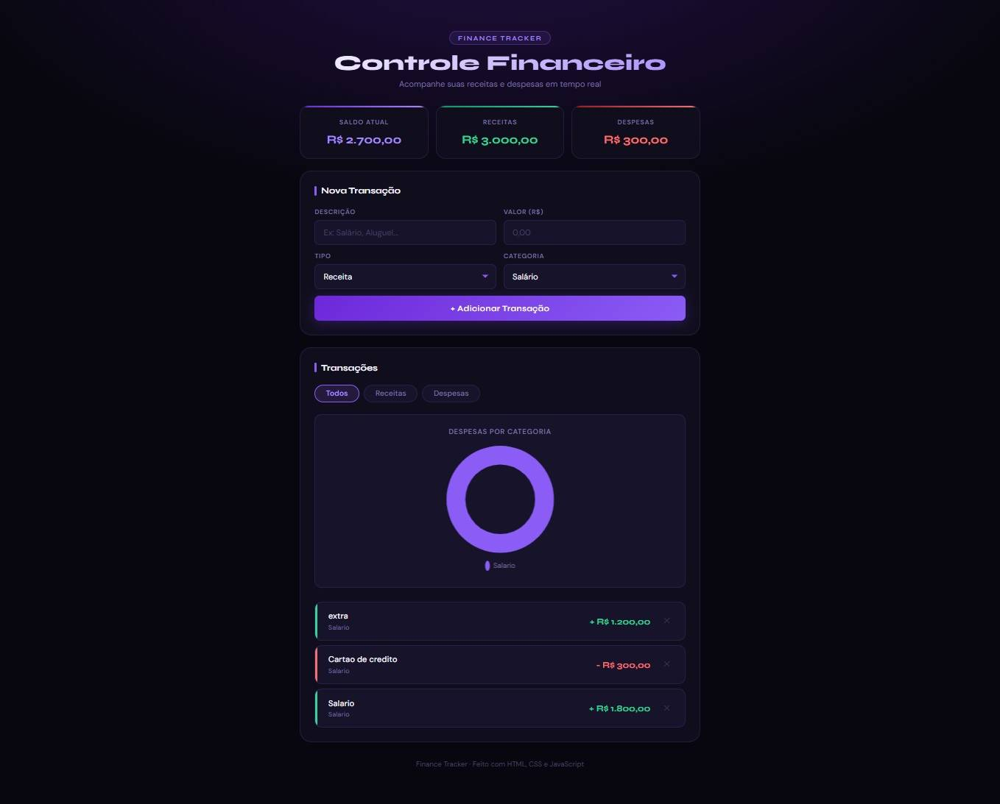

# Finance Tracker 💸

Aplicação de controle financeiro pessoal com dashboard em tempo real.

## Funcionalidades

- Adicionar receitas e despesas por categoria
- Saldo calculado automaticamente em tempo real
- Gráfico de rosca com despesas por categoria (Chart.js)
- Filtros por tipo de transação
- Validação de formulário inline
- Dados salvos no navegador (localStorage)
- Interface responsiva para mobile

## Tecnologias

## Acesse o projeto

[Finance Tracker ao vivo](https://juslli.github.io/Finance-trakerv2/)

---

Desenvolvido por [Junio Gianelli](https://github.com/juslli)
